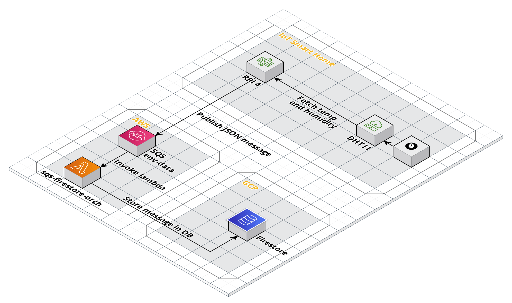

[](http://www.apache.org/licenses/LICENSE-2.0.html)

# iot-environment-monitoring

Deployed onto a Raspberry Pi equipped with a DHT11 sensor, this project reads environment data. 

Specifically designed to read air temperature and humidity, it will publish a json message to an AWS SQS message queue.

## Basic architecture


## How to run
- Clone project
- Create a virtual environment
```python
sudo pip3 install virtualenv 
virtualenv venv
```
- Install dependencies
```python
venv/bin/pip3 install -r requirements.txt
```
- Run project
```python
venv/bin/python3 -m iotenvmonitoring
```

## External Dependencies
This project relies on an AWS SQS Queue. 

During development (and how this project runs in its current state), [localstack](https://github.com/localstack/localstack) is used to simulate an SQS queue. There is a docker compose file in `utils` that can launch localstack. 
```dockerfile
cd utils
docker-compose up -d
```

For a "live" environment go into `config/application.conf` and change the `aws.sqs` config block to connect to actual AWS services.

## Outbound messages
Sample outbound message from this project
```json
{
  "collected-at" : "2020-01-01:12:00:00",
  "temperature-c": 10.0,
  "temperature-f" : 50.0,
  "humidity" : 0.57
}
``` 


### License
This code is open source software licensed under the [Apache 2.0 License]("http://www.apache.org/licenses/LICENSE-2.0.html")
